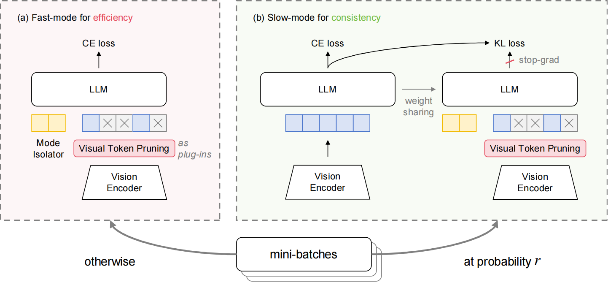

<h1 align="center"> Fast-Slow Efficient Training for Multimodal Large Language Models via Visual Token Pruning
</h1>

Achieving **2-4× training speedup** ⏩ for MLLMs while retaining **over 99% performance** 💪.

[📄[Paper](https://arxiv.org/abs/2602.03815)]

## Overview

DualSpeed comprises fast-slow modes. The fast-mode is the primary mode, which incorporates existing VTP methods as plugins to reduce visual tokens, along with a mode isolator to isolate the model's behaviors. The slow-mode is the auxiliary mode, where the model is trained on full visual sequences to retain training-inference consistency. To boost its training, it further leverages self-distillation to learn from the sufficiently trained fast-mode.



## Setup

This repo is lightly modified from the [LLaVA](https://github.com/haotian-liu/LLaVA) codebase. The setup is the same as the original codebase, including environment, data, and evaluation.

The core framework of DualSpeed is implemented in [llava_llama.py](https://github.com/dingkun-zhang/DualSpeed/blob/main/llava/model/language_model/llava_llama.py)

## Citation

If you find DualSpeed useful for your research and applications, please cite using this BibTeX:
```bibtex
@article{zhang2026dualspeed,
  title={Fast-Slow Efficient Training for Multimodal Large Language Models via Visual Token Pruning},
  author={Zhang, Dingkun and Qi, Shuhan and Wu, Yulin and Xiao, Xinyu and Wang, Xuan and Chen, Long},
  journal={arXiv preprint arXiv:2602.03815},
  year={2026}
}
```

## Acknowledgement

This repo is based on [LLaVA](https://github.com/haotian-liu/LLaVA) and [DivPrune](https://github.com/vbdi/divprune). We appreciate their open-source efforts.
